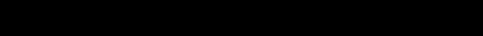

# DeepSteg: Deep learning based networks for image steganalysis and steganography
This is the open project for Deep learning based networks for image steganalysis and steganography, including our FaceAny, our DeepAny, and other reproduced literature on steganalysis and steganography.
## FaceAny: Fusion-aware Invertible Hiding Network for Multiple Face Anonymization [Paper Link]

### Overview


## DeepAny: Surface-guide Reversible Anonymization Network for Realistic Full-Body Privacy Preserving [Paper Link]
### Overview


#### The reproduced literature on steganalysis is listed as follows:
- XuNet (SPL2016): [**Structural Design of Convolutional Neural Networks for Steganalysis.**](https://ieeexplore.ieee.org/abstract/document/7444146) 
- YeNet (TIFS2017): [**Deep Learning Hierarchical Representations for Image Steganalysis.**](https://ieeexplore.ieee.org/abstract/document/7937836)
- StegNet (IH&MMSec2017): [**Fast and Effective Global Covariance Pooling Network for Image Steganalysis.**](https://dl.acm.org/doi/abs/10.1145/3335203.3335739)
- SRNet (TIFS2019): [**Deep Residual Network for Steganalysis of Digital Images.**](https://ieeexplore.ieee.org/abstract/document/8470101)
- ZhuNet (TIFS2020): [**Depth-Wise Separable Convolutions and Multi-Level Pooling for an Efficient Spatial CNN-Based Steganalysis.**](https://ieeexplore.ieee.org/abstract/document/8809687)
- SiaStegNet (TIFS2021): [**A Siamese CNN for Image Steganalysis.**](https://ieeexplore.ieee.org/document/9153041)
- More...

#### The reproduced papers on steganography is listed as follows:
- balujanet (TPAMI2020): [**Hiding images within images.**](https://ieeexplore.ieee.org/stamp/stamp.jsp?tp=&arnumber=8654686) 
- hidden (ECCV2018): [**HiDDeN: Hiding Data With Deep Networks.**](https://openaccess.thecvf.com/content_ECCV_2018/html/Jiren_Zhu_HiDDeN_Hiding_Data_ECCV_2018_paper.html)
- wengnet (ICMR2019): [**High-Capacity Convolutional Video Steganography with Temporal Residual Modeling.**](https://dl.acm.org/doi/abs/10.1145/3323873.3325011)
- hinet (ICCV2021): [**HiNet: Deep Image Hiding by Invertible Network.**](https://openaccess.thecvf.com/content/ICCV2021/html/Jing_HiNet_Deep_Image_Hiding_by_Invertible_Network_ICCV_2021_paper.html)
- More...

## Dependencies and Installation
- Python 3.10, PyTorch (conda)
- Run the following commands in your terminal:

  `conda env create -f env.yaml`

  `conda activate deepsteg`

## Updates
- ✅ 2025-01-14: reproduce the codes, models and results of DeepSteg.
- ✅ 2025-01-15: Release the first version of the project.
- ✅ 2025-01-29: Release the codes and models of FaceAny.
- **(To do)** More detail will be added ... 

## Configuration (Options)
- All runtime settings live in `options/` and are loaded by `config.py` / `config_steg.py`.
- Train/Test are split into separate YAML files:
  - Steganalysis: `options/steganalysis/train.yaml`, `options/steganalysis/test.yaml`
  - Steganography: `options/steganography/train.yaml`, `options/steganography/test.yaml`
- You can override the option file at runtime:
  - `python srnet.py --opt options/steganalysis/train.yaml`
  - `python hinet.py --opt options/steganography/test.yaml`
- Convenience scripts (recommended):
  - Steganalysis: `bash scripts/train_srnet.sh`, `bash scripts/test_srnet.sh`, `bash scripts/train_xunet.sh`, `bash scripts/test_xunet.sh`, `bash scripts/train_yenet.sh`, `bash scripts/test_yenet.sh`, `bash scripts/train_zhunet.sh`, `bash scripts/test_zhunet.sh`, `bash scripts/train_stegnet.sh`, `bash scripts/test_stegnet.sh`, `bash scripts/train_siastegnet.sh`, `bash scripts/test_siastegnet.sh`
  - Steganography: `bash scripts/train_hinet.sh`, `bash scripts/test_hinet.sh`, `bash scripts/train_hinet_adv.sh` (HiNet + steganalysis-aware variant), `bash scripts/train_hidden.sh`, `bash scripts/test_hidden.sh`, `bash scripts/train_balujanet.sh`, `bash scripts/test_balujanet.sh`, `bash scripts/train_wengnet.sh`, `bash scripts/test_wengnet.sh`
- Relative paths in YAML resolve from the repo root.
- Multi-GPU: set `use_data_parallel: true` and adjust `device_ids` or `*_device_ids` in YAML.

## Project Snapshot


**Benchmark results on BossBase (placeholder)**
| Model | Params(M) | Multi-Adds(G) | SRNet | ZhuNet | XuNet | YeNet | StegNet | SiaStegNet |
|-------|:---------:|:------------:|:-----:|:------:|:-----:|:-----:|:-------:|:---------:|
| balujanet | TBD | TBD | TBD | TBD | TBD | TBD | TBD | TBD |
| hidden | TBD | TBD | TBD | TBD | TBD | TBD | TBD | TBD |
| wengnet | TBD | TBD | TBD | TBD | TBD | TBD | TBD | TBD |
| hinet | TBD | TBD | TBD | TBD | TBD | TBD | TBD | TBD |

## Data Preparation

### Dataset folder conventions (this repo)

**Steganalysis (cover/stego pairs)**
- Expected structure (recommended):

```
<train_data_dir>/
  cover/xxx1.png
  cover/xxx2.png
  stego/xxx1.png
  stego/xxx2.png

<val_data_dir>/ (same)
<test_data_dir>/ (same)
```

Notes:
- `utils/dataset.py` enforces that `cover/` and `stego/` have the **same filenames**.
- `get_test_loader()` supports the pair-folder format above, and falls back to `torchvision.datasets.ImageFolder` if `cover/` and `stego/` are not present.

**Steganography (cover/secret image streams)**
- Expected structure:

```
<data_dir>/<data_name>/
  train/*.png
  test/*.png
```

### Where to get datasets (references)
Because datasets differ in license/availability, we only provide **official source links** and folder guidance here:

- DIV2K (super-resolution / image source, used here as cover/secret pool):
  - https://data.vision.ee.ethz.ch/cvl/DIV2K/
- COCO (general image source):
  - https://cocodataset.org/
- ImageNet (general image source; requires registration):
  - https://www.image-net.org/

For steganalysis benchmarks, common datasets include (availability varies):

- **BOSSBase (a.k.a. BOSSBase 1.01 / BOSS)**
  - A classic steganalysis benchmark of grayscale images used in many steganalysis papers.
  - **Access**: not always hosted as a simple public download; many groups obtain it via academic channels.
  - Typical ways researchers get BOSSBase:
    - Follow the dataset reference in the original papers/tutorials and request access through the dataset maintainers or affiliated lab pages.
    - Ask the corresponding authors of recent steganalysis papers for the exact acquisition instructions they used.
    - Use your lab/institution’s existing copy if available.
  - **Folder mapping for this repo**:
    - Put cover/stego pairs under `train_data_dir/cover` + `train_data_dir/stego` (and same for val/test).
    - Keep filenames aligned (e.g., `000001.pgm` in both cover and stego).

- **BOWS2**
  - Another widely-used dataset in steganalysis, often used together with BOSSBase for training/validation.
  - **Access**: similar to BOSSBase, it may require academic request / non-commercial usage agreement.
  - **Tip**: If you cannot obtain BOSS/BOWS2, you can still run the code by building your own cover/stego pairs from any image source and your chosen stego embedding tool.

- **ALASKA2 (steganalysis competition dataset)**
  - https://www.kaggle.com/c/alaska2-image-steganalysis

### Configure paths
Edit YAML options files instead of modifying Python code:
- Steganalysis: `options/steganalysis/train.yaml` / `options/steganalysis/test.yaml`
  - `train_data_dir`, `val_data_dir`, `test_data_dir`
- Steganography: `options/steganography/train.yaml` / `options/steganography/test.yaml`
  - `data_dir`, `data_name_train`, `data_name_test`, `suffix`

## Get Started
#### Training for steganalysis
1. Update `options/steganalysis/train.yaml`
   - `mode: train`
   - `train_data_dir`, `val_data_dir`
   - `stego_img_height`, `stego_img_channel`
2. Run `python *net.py`. For example, `python srnet.py`

Example commands:
```
python srnet.py --opt options/steganalysis/train.yaml
bash scripts/train_srnet.sh
```

#### Training for steganography
1. Update `options/steganography/train.yaml`
   - `mode: train`
   - `data_dir`, `data_name_train`, `data_name_test`
2. Run `python *net.py`, for example, `python wengnet.py`

Example commands:
```
python hinet.py --opt options/steganography/train.yaml
bash scripts/train_hinet.sh
```

#### Testing for steganalysis
1. Update `options/steganalysis/test.yaml`
   - `mode: test`
   - `test_data_dir`
   - `pre_trained_*net_path`
2. Run `python *net.py`

Example commands:
```
python srnet.py --opt options/steganalysis/test.yaml
bash scripts/test_srnet.sh
```

- The trained steganalysis networks will be saved in `checkpoints/`
- The results and running logs will be saved in `results/`

#### Testing for steganography
1. Update `options/steganography/test.yaml`
   - `mode: test`
   - `test_*net_path`
2. Run `python *net.py`

Example commands:
```
python hinet.py --opt options/steganography/test.yaml
bash scripts/test_hinet.sh
```

- Here we provide [trained models](https://drive.google.com/drive/folders/1lM9ED7uzWYeznXSWKg4mgf7Xc7wjjm8Q?usp=sharing).
- The processed images, such as stego image and recovered secret image, will be saved at 'results/images'
- The training or testing log will be saved at 'results/*.log'
 
## Others
- We don't adopt the default settings from the literature. Instead, all stegeanalysis networks are optimized using Adam solver with a weight decay of 1e-5 and an initial learning rate of 2e-4.

## Results
The inference results on benchmark datasets are available at
[Google Drive](https://drive.google.com/drive/folders/1lM9ED7uzWYeznXSWKg4mgf7Xc7wjjm8Q?usp=sharing).


## Acknowledgement
- We would like to express our gratitude to the authors of the relevant papers. If you find this work useful, please cite the original paper source.
- We would like to express our gratitude to the listed open-source projects.
  - [Deep-Steganalysis](https://github.com/albblgb/Deep-Steganalysis.git)
  - [Hiding-images-within-images](https://github.com/albblgb/Hiding-images-within-images.git)
## Contact
- If you have any question, please email yew.wang.os@hotmail.com
